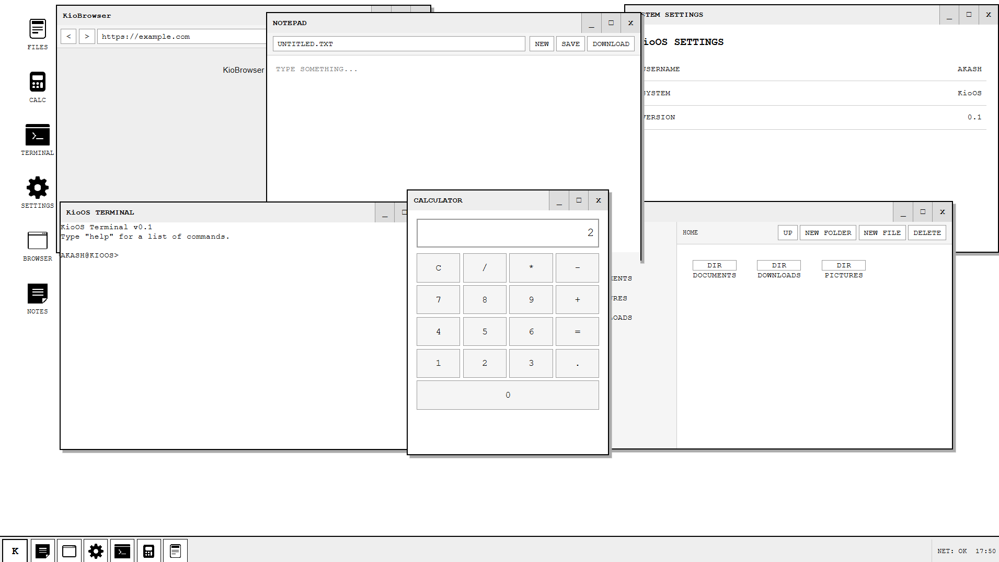
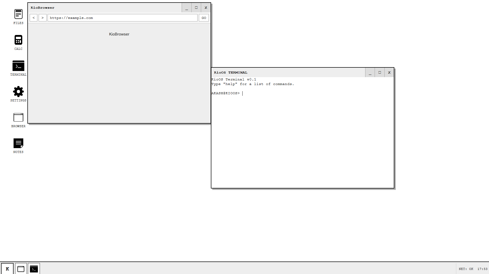
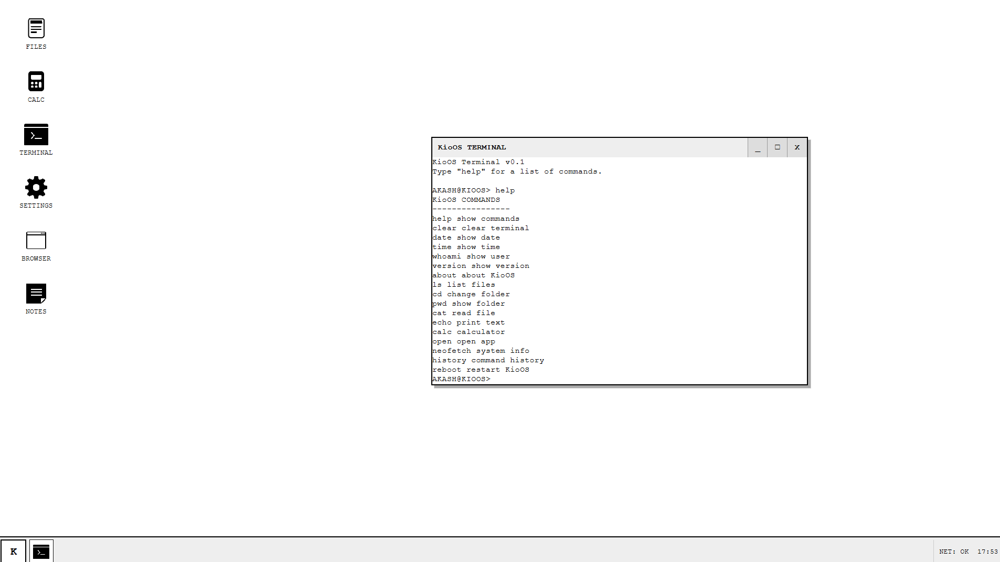

# KioOS



A small retro-style web OS I built using HTML, CSS and JavaScript.

KioOS is basically my attempt at making a little computer inside a browser. It has windows, apps, a terminal, files and a desktop that all work together.

## Features

* Retro-style desktop
* Boot screen
* File manager
* Terminal
* Browser
* Notepad
* Calculator
* Settings
* Start menu
* Taskbar
* Virtual file system
* Command history
* Draggable windows
* LocalStorage support

### Terminal

The terminal has commands like:

`help` `ls` `cd` `pwd` `cat` `calc` `open` `neofetch` `history` `reboot`

## Screenshots

### Desktop


### Apps



### Terminal




## Built With


## Run It

Clone the repo:

```bash
git clone https://github.com/akashsuu/KioOS.git
```

Then open `index.html` with VS Code Live Server.

No build tools or frameworks are needed.

## About

I made KioOS while experimenting with HTML, CSS and JavaScript. The fun part was trying to make a bunch of small browser features feel like an actual operating system.

It's not meant to replace a real OS. It's just a little OS that lives in a browser.

Made with code, curiosity, and a little bit of meow.

**KioOS — Kio speaks meow. 🐱**
